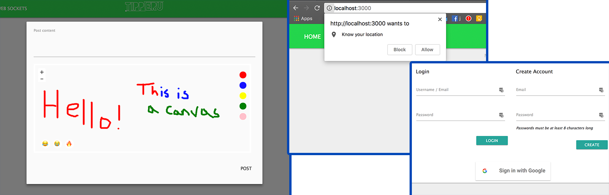
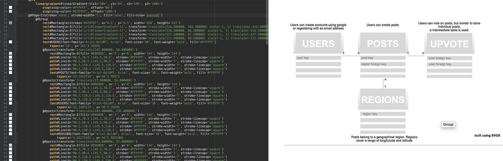
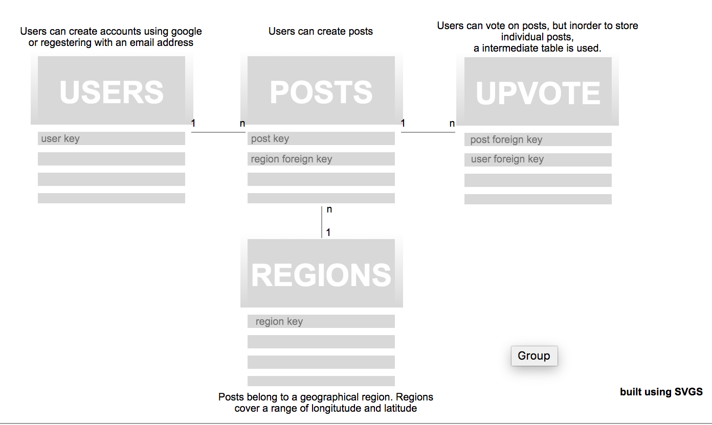
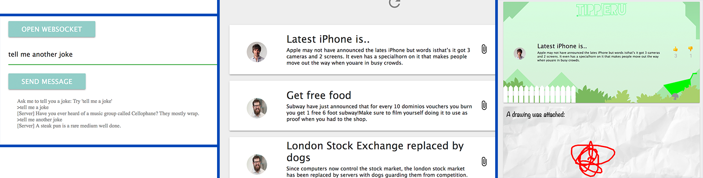

# tippe.ru Report (Ben Allen, Nick Pearson)
tippe.ru is an anonymous secret sharing website. The site is built as a web app where users can post text and image content. The posts are location based, initially only being seen by people in the immediate area. If a post gets a lot of traction it is promoted to a wider area and seen by more people.

## A for HTML
- We used the Pug (formally Jade) framework to ensure generation of valid HTML pages. Verification of our pages is done using a HTML validator automatically to ensure our client side dynamic page content also produced valid HTML. We've used an extensive range of HTML tags including recent additions from HTML5 such as `canvas`.
## A for CSS
- We integrated the Materialize CSS framework for basic styling. We used a seperate stylesheet for more advance modification of the framework to fit the design we wanted. This seperate stylesheet allows to use custom CSS transitions and animations to create our loading screen and let's us achieve the responsive layout we are after. We are then able to remove unused classes from the Materialize CSS framework were necessary.
## A for JS
- We used AJAX requests extensively to create a single page application.
- We integrated the Google sign in API.
- We used javascript to handle button presses and changes of state on the page.
- We used the HTML5 geolocation API to determine the client's real world location.
- We used HTML5 canvas to allow the user to paint onto an image they want to upload. This uses an advance custom algorithm to allow dragging and dropping of stickers, custom drawing in multiple colours and enlarging of items.  

## A for PNG
- We created a background graphic for our posts. Using multiple layers, transparency, complex gradients and the creation of custom shapes using the pen tool we were able to create compelling graphics.
## A for SVG
- We created custom SVG assets for our icons and loading graphics.
- We created complex SVG assets seen on the project info page for describing our project.
- SVG graphics used use paths, gradients, borders, grouping and transparency to achieve the effect we were after.

## A for Server
- We implemented a RESTful API to handle our login system, posts and location systems.
- We implemented unit tests for our server code and used a linter to identify errors and style issues with our server side code.
- We hosted our server using Google App Engine and used continuous integration with TravisCI to manage this and run our automated tests.
- We use redirections to ensure privileged parts of the site cannot be accessed without prior approval.
- We make use of cookies to store tokens that allow for automatic logging in.
- We use sessions to allow for smooth access across throughout the site without the need of logging in.
- We support UTF-8 on our API.
- We work with cache control to avoid data being cached accidentally.

## A for Database
- We use SQLite
- We have implemented SQL queries for finding and inserting data.
- We implement advance SQL queries to cross query multiple tables to avoid the need for multiple requests. 
- We implemented complex SQL using transactions for the Upvoting system.

## A for Dynamic Pages
- We used the Jade framework to insert a small amount of data server side.
- We implemented our 'feed' of posts using client side javascript. We used templates on the client side to add content to the page dynamically.
- Websockets

## ? for Depth
